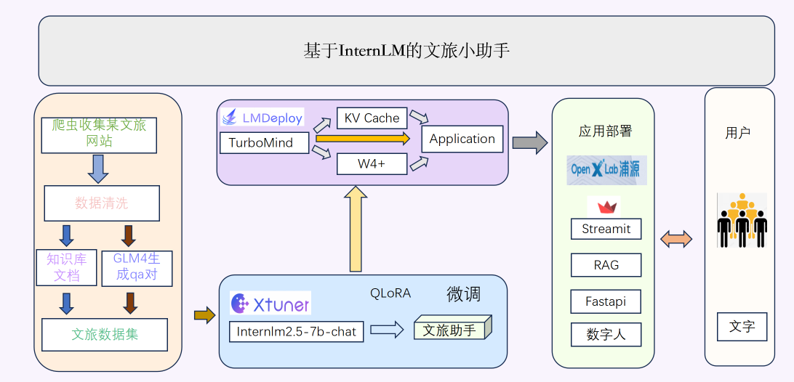

# 基于InternLM的文旅小助手

## 📖 项目概述
基于InternLM的文旅小助手是一款利用人工智能技术，为旅游和文化领域提供智能服务的工具。以下是它的简介：基于InternLM的文旅小助手是一款集成了最新LLM技术的智能服务系统，旨在为用户提供个性化、高效的旅游和文化体验。无论是规划旅行、探索当地文化，还是寻找美食和娱乐活动，文旅小助手都能提供全方位的支持。

模型用 [xtuner](https://github.com/InternLM/xtuner) 在 [InternLM2.5](https://github.com/InternLM/InternLM) 的基础上微调而来，部署集成了 LMDeploy **加速推理**🚀，支持 **RAG 检索增强生成** ，加入带有感情的 **TTS 文字转语音**🔊生成，最后还会生成 **数字人语音视频** 🦸。

### 🏷️ 项目架构图

    

### 😊 主要功能
1. 个性化推荐
2. 智能问答
3. 语音回答
4. 数字人交互

### 🚩 项目愿景
问任何关于旅行的事情都可以从模型获取，并且保证信息的时效性和真实性。
