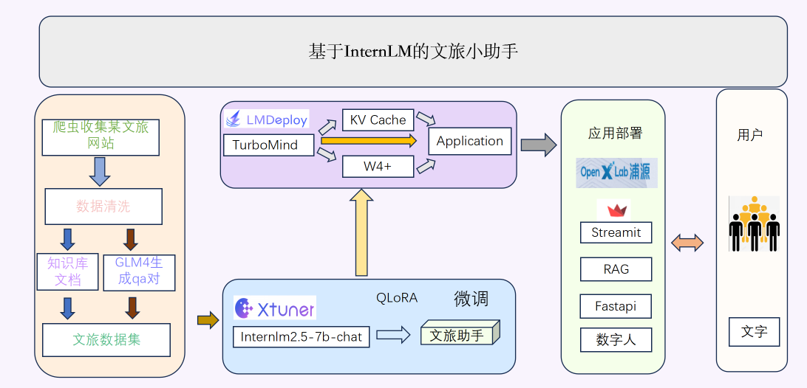

# 基于InternLM的文旅小助手

## 📖 项目概述
基于InternLM的文旅小助手是一款利用人工智能技术，为旅游和文化领域提供智能服务的工具。以下是它的简介：基于InternLM的文旅小助手是一款集成了最新LLM技术的智能服务系统，旨在为用户提供个性化、高效的旅游和文化体验。无论是规划旅行、探索当地文化，还是寻找美食和娱乐活动，文旅小助手都能提供全方位的支持。

模型用 [xtuner](https://github.com/InternLM/xtuner) 在 [InternLM2.5](https://github.com/InternLM/InternLM) 的基础上微调而来，部署集成了 LMDeploy **加速推理**🚀，支持 **RAG 检索增强生成** ，加入带有感情的 **TTS 文字转语音**🔊生成，最后还会生成 **数字人语音视频** 🦸。

### 🏷️ 项目架构图
<p align="center">
    
</p>

### 😊 主要功能
1. 个性化推荐
2. 智能问答
3. 语音回答
4. 数字人交互

## 📺️ 视频演示
[观看视频](https://www.bilibili.com/video/BV14FY1ejEun/?spm_id_from=333.999.0.0&vd_source=49d7dc394125d1aa584fca04e78a909f)


## 🧾 任务

- [x] 文本生成功能
- [x] 文旅知识库创建
- [ ] 语音识别功能
- [x] 语音生成功能
- [x] 数字人功能
- [ ] Lagent工具调用
- [x] RAG检索
- [ ] 模型持续微调

## 🛠️ 使用方法

### 环境准备

#### RAG环境准备

```bash
 cd environment
 conda env create -f  demo.yml
```

#### TTS环境准备

```bash
 cd environment
 conda env create -f  cosyvoice.yml
```

#### 数字人环境准备

```bash
 cd environment
 conda env create -f  sadtalker.yml
```

### 模型下载

[下载微调的基座大模型](https://openxlab.org.cn/models/detail/ljk-0/wenlv)
[下载BCE模型](https://www.modelscope.cn/models/netease-youdao/bce-embedding-base_v1)
[下载CosyVoice模型](https://www.modelscope.cn/models/iic/CosyVoice-300M-SFT)
[下载sadtalker模型](https://www.modelscope.cn/models/wwd123/sadtalker)


### 系统运行

#### 修改配置文件

修改config.ini文件

```bash
[paths]
audio_folder_path = #tts音频存储地址
CosyVoice_model_path =  #cosyvoice下载模型地址
llm_model_path =  #微调的llm模型地址
db_vector_path = ./db_vector
embedding_path =  #bce模型地址
sadtalker_path = #下载的sadtakler的checkpoints地址
data_human_path =   # 数字人存储地址
source_image_path = ./source_image/full_body_1.png
```

将下载的sadtakler模型权重中的gfpgan下边的weights内的所有文件移动到data_human/gfpgan/weights这个目录下边。

#### 运行服务

运行页面端

```bash
conda activate demo
streamlit run page.py
```

运行RAG服务

```bash
cd rag
conda activate demo
python client.py
```

运行TTS服务

```bash
cd tts
conda activate cosyvoice
python tts_server.py
```

运行数字人服务

```bash
cd data_human
conda activate sadtalker
python api_server.py
```

## 未来规划

- 在模型方面，将不断迭代模型微调，符合文旅场景。
- 在应用方面，将引入agent功能。


## 💕 致谢

***感谢 上海人工智能实验室 组织的书生·浦语大模型实战营学习活动 和 提供的强大算力支持~***

***感谢 OpenXLab 对项目部署的算力支持~***

***感谢 浦语小助手 对项目的支持~***

项目中所涉及的内容包括：

[**InternStudio**](https://studio.intern-ai.org.cn/)  
[**Tutorial**](https://github.com/InternLM/tutorial)  
[**InternLM**](https://github.com/InternLM/InternLM)  
[**XTuner**](https://github.com/InternLM/xtuner)   
[**LMDeploy**](https://github.com/InternLM/lmdeploy)  

感谢项目中使用的其他开源组件，包括：
* 文本转语音模型：[CosyVoice](https://github.com/FunAudioLLM/CosyVoice)
* 数字人生成模型：[SadTalker](https://github.com/OpenTalker/SadTalker)
* Embedding模型：[bce-embedding-base_v1](https://www.modelscope.cn/models/netease-youdao/bce-embedding-base_v1)